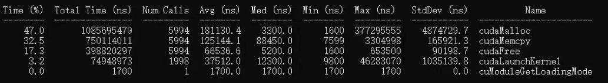
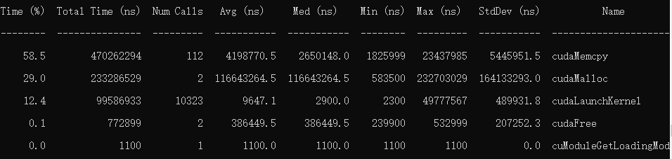
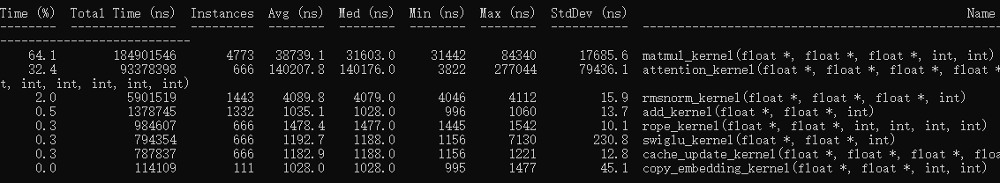
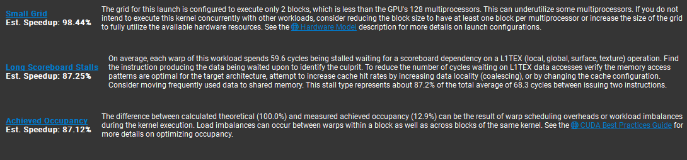
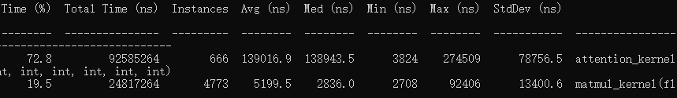
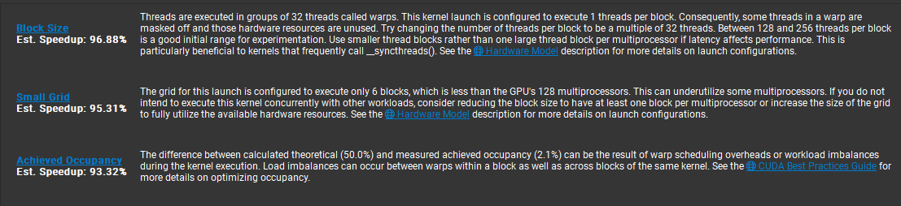

# 推理引擎开发总结
本项目是一个从零开发的大模型轻量级推理引擎。以深入理解大模型底层计算与硬件性能瓶颈为目标，经历了“纯 C++ -> CUDA 算子重构 -> PyTorch 前后端解耦”的过程。
## 1.开发流程

### 1.v1:纯C++版本,基础架构验证
- 目标：正确实现Transformer前向传播计算
- 实现：参考【llama2.c】(https://github.com/karpathy/llama2.c)源码，使用C++实现了权重读取，完整的前向推理链路
### 2.v2:CUDA异构计算与性能调优
v1.0跑通后，引入NVIDIA Nsight工具链进行性能优化，实现算子重构
#### 优化点1：显存预分配
- **瓶颈定位**：使用`nsys`分析发现，Kernel计算时间占比少，cudaMalloc/cudaMemcpy/cudaFree占据90%以上时间
- **优化过程**：引擎初始化阶段进行显存预分配；引入mmap减少拷贝时间

优化前：

优化后：


#### 优化点 2：矩阵乘法算子优化
对算子性能进行具体分析，如下图

发现矩阵乘法、注意力、rms是最耗时的三个算子，因此先对矩阵乘法进行优化
- **瓶颈定位**：使用ncu对矩阵乘法算子进行分析，报告如下

问题是线程占用率低，访存不连续
- **优化过程**：原代码为了确保正确性，每个线程计算一行。修改后每个block计算一行，block内线程计算点积。引入共享内存、规约求和

```

__global__ void matmul_kernel(float* out, float* x, float* weight, int m, int n) {
    int row = blockIdx.x;
    int c = threadIdx.x;
    
    float val = 0.0f;
    for (int j = c; j < n; j+=blockDim.x) {
        val += weight[row * n + j] * x[j];
    }
    
    // 此时val是每个线程自己的和，要全部相加
    // 把每个线程算的部分和写到共享内存
    __shared__ float sdata[256];
    sdata[c] = val;
    __syncthreads();

    for (int s = 1; s < blockSize; s *= 2) {
        if (c % (2 * s) == 0) {
            sdata[c] += sdata[c+ s];
        }
        __syncthreads();
    }

    if (c == 0) {
        out[row] = sdata[0];
    }
    
}
void launch_matmul(float* d_out, float* d_x, float* d_weight, int m, int n) {
    matmul_kernel<<<m, 256>>>(d_out, d_x, d_weight, m, n);
}
```

- **优化成果**：耗时显著降低，平均耗时由38739ns降低为5199ns

#### 优化点3：Attention 与 RMSNorm 算子并行化
- **瓶颈定位**：类似乘法算子，使用ncu进行分析
原因同样时并行化较低
- **优化过程**：采用同样的 Shared Memory 规约思路，将单线程的 Attention Score 计算、Softmax 以及 V 矩阵加权求和并行化。
- **优化成果**：

| 核心算子 | 优化前平均耗时 |优化后平均耗时 |
| :--- | :--- | :--- |
| RMSNorm | 4089 ns | 2347 ns |
| Attention | 140207ns | 27991 ns |

#### 优化点4：对规约的优化
- **瓶颈定位**：由于warp分化，原来的规约方式会有大量线程空转，浪费计算资源
- **优化过程**：改为交错寻址规约
```
for(int s = blockDim.x / 2; s>0; s >>= 1){
        if(c < s){
            sdata[c] += sdata[c + s];
        }
        __syncthreads();
    }
```
- **优化成果**：

| 核心算子 | 优化前平均耗时 |优化后平均耗时 |
| :--- | :--- | :--- |
| RMSNorm | 2347 ns | 1866 ns |
| Attention | 27991ns | 27326 ns |
| matmul | 5199ns | 3515ns|

### 3.v3:Pytorch前后端解耦（进行中）
- **目前问题**：纯 C++ 引擎在处理复杂 Tokenizer、采样算法以及不同模型架构的权重加载时，缺乏兼容性。
- **解决方法**：采用业界主流的 “Python 前端 + C++ 算子后端” 设计，将自研的高性能 CUDA 算子封装为 PyTorch Custom Extension
- **当前进展**：已针对 Qwen-1.5B 模型，成功将原生框架层的 RMSNorm 替换为自研 C++ 算子。未来将逐步合并其它算子。
